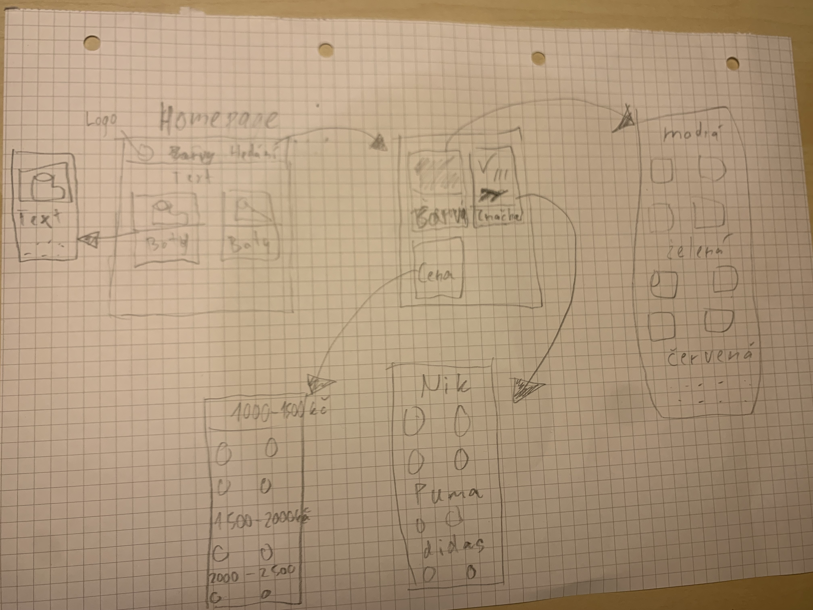
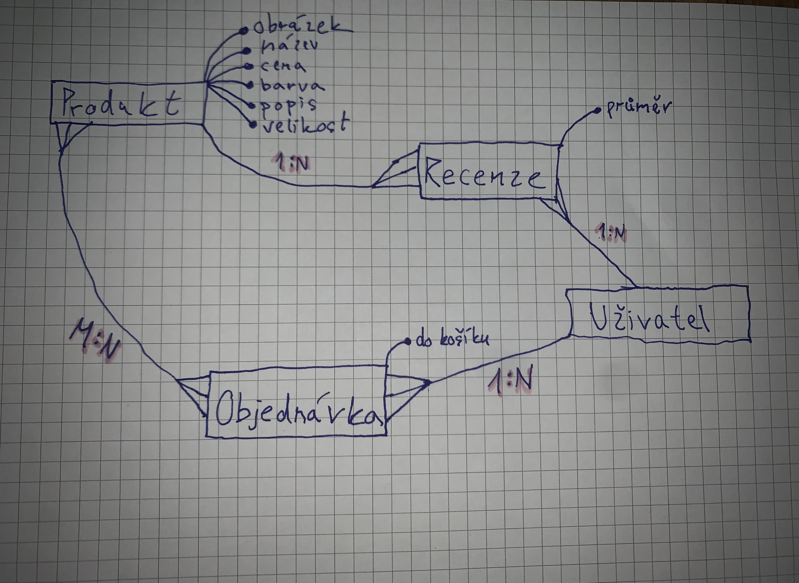

# SPORTOVNÍ OBUV
*Autor: Oliver Vachta <a href="oliver.vachta.s@gyarab.cz">oliver.vachta.s@gyarab.cz</a>*

**Obchod sportovní obuvy - <a href="https://ov.gawt.dtcloud.cz">https://ov.gawt.dtcloud.cz</a>**

**Ročníkový projekt z předmětu webové technologie ve šk. roce 2024/2025.**
## Odborný článek
**Projektový záměr zahrnuje vývoj webu Sportovní Obuv, která bude sloužit jako wikipedie specializovaná na prodej sportovní obuvi. Klíčovými datovými objekty jsou Produkt, Uživatel, Objednávka a Recenze. Produkt zahrnuje atributy jako název, cena, popis, velikost, barva a obrázek.**

**V administraci se spravuje databáze produktů, každý produkt má název, cenu, popis, velikost, barvu a obrázek. Každý produkt patří do jedné kategorie a může mít několik recenzí od zákazníků.**

**Na homepage je seznam produktů, který je možné filtrovat podle kategorie, velikosti a barvy a řadit podle ceny. Seznam produktů tvoří kartičky, na kterých se zobrazuje obrázek produktu, název, cena a krátký popis. Kliknutím na kartičku se zobrazí stránka detailu produktu, kde jsou uvedeny všechny atributy produktu včetně více obrázků a zákaznických recenzí. Z detailu produktu je možné přidat produkt do košíku nebo se vrátit zpět na seznam produktů.**
## Wireframe

## DB schéma

